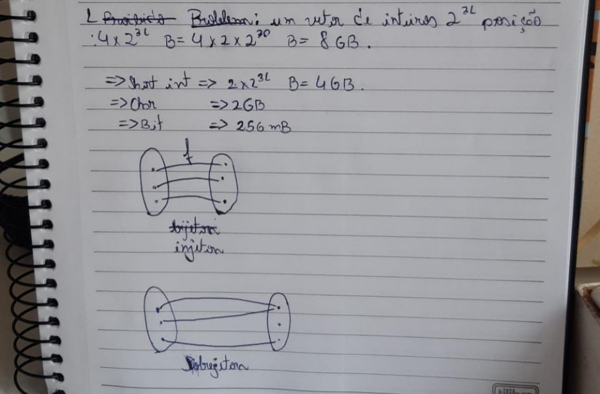
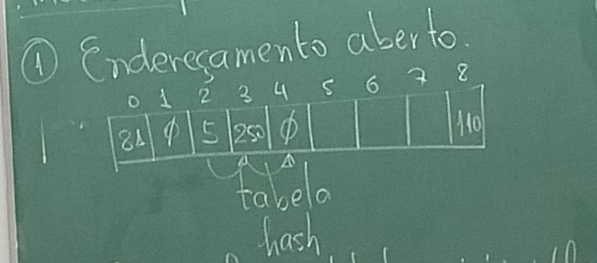
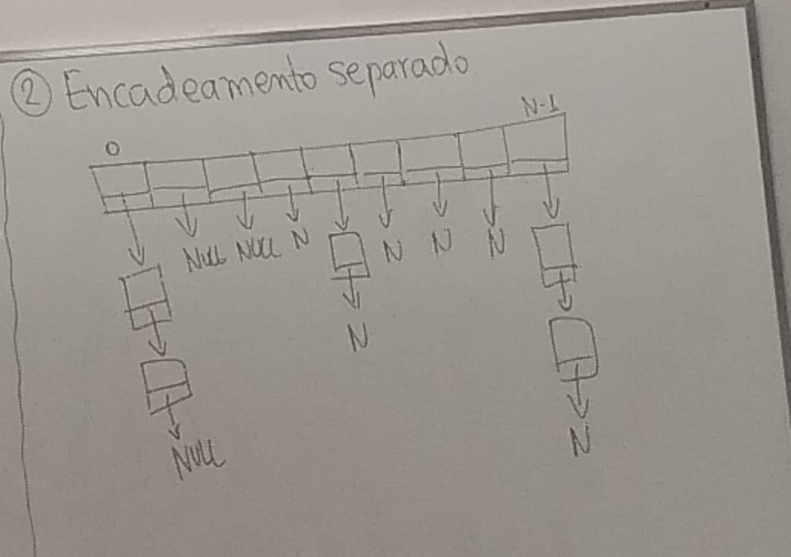

Quando compensa ordenar para fazer buscas?

Ordenar + buscar = O(nlgn + lgn)

O(nlgn) + O(lgn) = O((n+1)lgn)

Busca sequencial = O(n)

Portanto, para uma única busca, não compensa ordenar.

Por outro lado, se a quantidade de buscar for grande (into é, muito mais que n busca) compesa, pois:

Ordenar + n buscas = O(nlgn)

O(nlgn) + n*O(lgn)

Por outro lado

n buscas sequenciais

n*O(n) = O(n²)

Consideremos o problema dos números proibidos

- Temos uma lista com n números proibidos (n <= 140000) dada na entrada
- Cada número varia entre 1 e 2³¹
- Para cada consulta, deseja classificar o número se proibido ou não.

Solução 1: Salvo os números proibidos num vetor de tamanho n e para cada consulta, faça um busca sequencial **Custo: O(m*n)**

- Custo elevado se forem muitas buscas
  
Solução 2: Ordenar e buscar **O(nlgn) + O(nlgn) = O((n+m)lgn)**

- Bom se tiver muitas buscas

Solução 3: **O(m+n)**

- Declara um vetor v com 2³¹ elementos e zero o vetor
- Para cada número proibido i, define v[i] = 1 * O(n)
- Para cada busca com número k, se v[j] = 0, então o número não é proibido, se v[j] = 1, o número j é proibido. O(m)

**Custo total = O(1)+O(n)+O(n+m)**

	

		int hash(int x){
			return x%140000;
		}

		int main(){
			int N,M;
			int i, num;
			int *v = calloc(sizeof(int),140000);

			scanf("%d ",&n);
			for(i = 0; i < N; i++){
				scanf("%d ",&num);
				v[hash(num)] = num;
			}

			while(scanf("%d ",&num) != EOF){

				int h = hash(num);

				if(v[h] == num){
					printf("Proibido\n");
				}else if(v[h] == 0){
					print("Não é proibido\n);
				}else if(v[h] != num){
					
				}
				return 0;
			}
		}

## Métodos para resolver colisãoes

1) Endereçamento aberto

	

-	A função hash estabelece o início para fazer a busca no vetor, para-se quando encontrar vazio.
-	No caso de colisões, salva-se na proxima posição isponível

## Problemas
1) A tabela hash não pode ficar cheia. Quando estiver por encher, é necessário redimensioná-los a um custo O(n) (em que n é o tamanho da hash)
2) A busca numa tabela hash **densa** é pior. Quanto nemor a esparsidade (eq. maior a mensidade), pior a busca

### Obs.:

Esparsidade é o total de elementos "nulos" em um vetor, ou seja:

		              #elementos vazios
		Esparsidade = -------------------
					     #elementos

Densidade é o complemento:

					 #elementos não vazios
		Densidade = -----------------------
					 	 #elementos

	

Obs.: Como listas não ocupam posições continuas na memória a busca pode ser mais lenta por conta de muitas folas que podem ocorrer na memória.