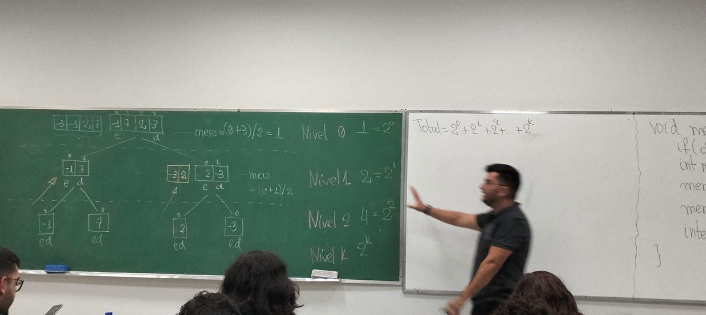

# Mergesort (Ordenação intercalada)

- Divisão e conquista

Dado um vetor, divide-o no meio e ordena recursivamente cada metade. Na volta, intercalada as duas metades e obtém o vetor ordenado. Comp.: O(nlgn) (linearítmico)

        void mergeSort (int *v, int e, int d){

            if(d <= e) return;

            int meio = (e+d)/2;

            mergeSort(v, e, meio);
            mergeSort(v, e, meio+1, d);

            intercala(v, e, meio, d);
        }
        intercala(int *v, int e, int meio, int d){
            int *v2 = malloc((d-e+1)*sizeoff(int));
            int i = e; j = meio + 1; k = 0;
            while(i <= meio && j <= d){
                if(v[i] <= v[j]) v2[k++] = v[j++];
                else v2[k++] = v[j++];
            }
            while(i <= meio) v2[k++] = v[i++];
            while(j <= d) v2[k++] = v[j++];
            for(k=0,i=e;i<=d;k++,i++) v[i]=v2[k];
        }

	

1) Acada nível da árvore, fazemos operações com comp. O(n).0
2) Logo, o total de operações é a quantidade de níveis da árvore multiplicado por O(n).
3) Quantos níveis possui uma árvore gerada para um vetor de n elementos, n=2
4) Logo, como cada nível custa O(n), a comp. total é O(nlg(n))