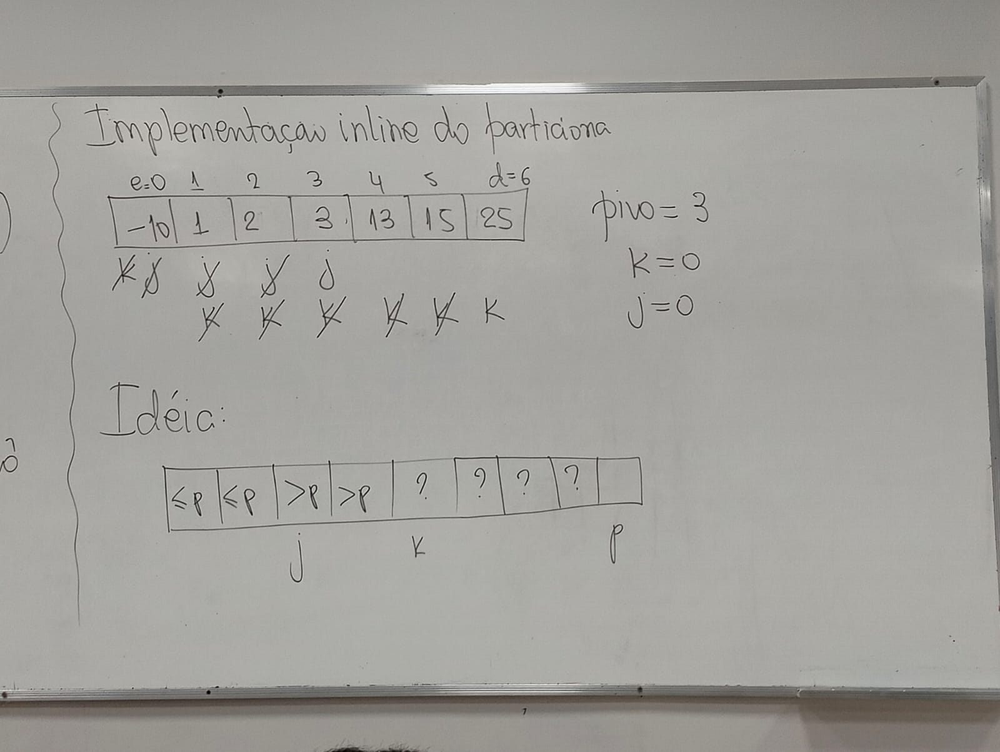

# Quicksort

        void quicksort(int *v, int e, int d){
            if(d <= e) return;
            int j = particiona(v,e,d);
            quicksort(v,e,j-1);
            quicksort(v,j+1,d);
        }
        int particiona(int *v, int e, int d){
            int tamanho = d-e+1;
            int *menores = malloc(sizeof(int)*tamanho);
            int *maiores = malloc(sizeof(int)*tamanho);
            int pivo = [d];
            int imenores=0,imaiores=0;

            for(int k = e; k<=d; k++){
                if(v[k]<pivo){
                    menores[imenores++]=v[k];
                }else{
                    maiores[imaiores++]=v[k];
                }
            }
            int i = e;

            for(int k = 0; k < imenores; k++>){
                v[i++]=menores[k];
            }

            int posPivo = i; v[i++]=pivo;
            for(int k=0;k<imaiores;k++){
                v[i++]=maiores[k];
            }
            free(maiores);
            free(menores);
            return posPivo; // posição do pivô
        }

Ex:

-4|10|5|15|23|18
--|--|--|--|--|--
e|--|--|j|--|d

j = pivô

Implementação inline do particiona

	

        int particiona(int *v, int e, int d){
            int pivo = v[d]; 
            int j=e;
            for(int k = e;k<d;k++>){
                if(v[k]<= pivo){
                    troca(v,k,j);
                    j++;
                }
            }
            troca(v,j,d);         
            return j;
        }
        void troca(int *v, int i, int j){
            int tmp = v[i];
            v[i] = v[j];
            v[j] = tmp;   
        }