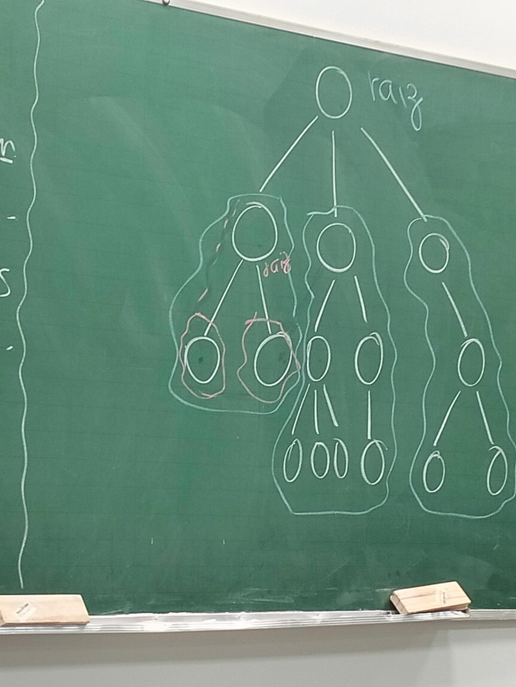
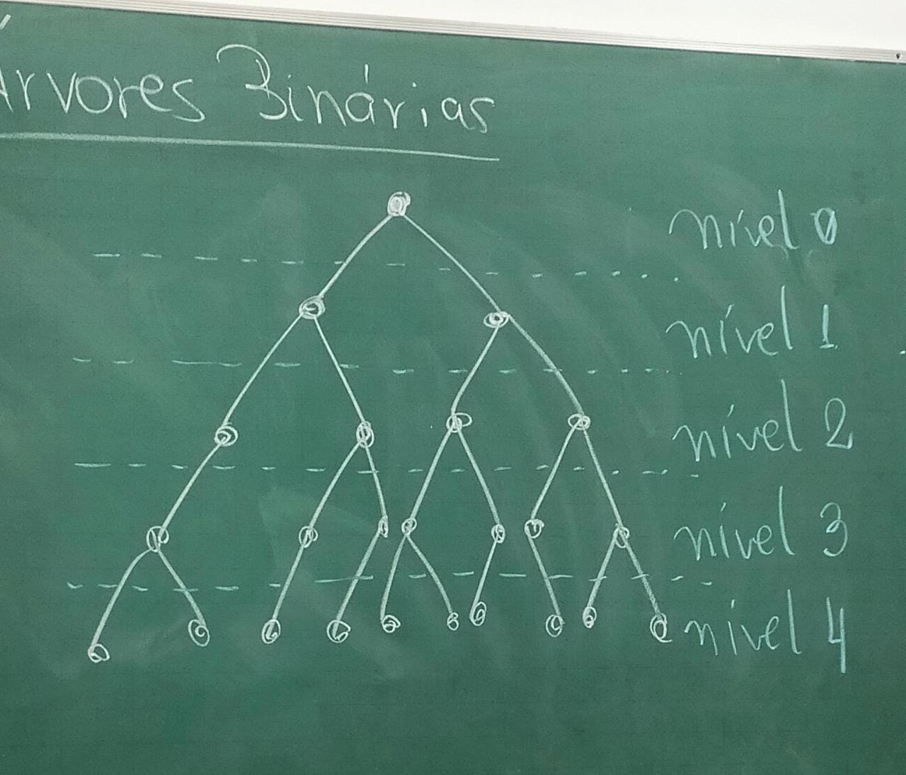
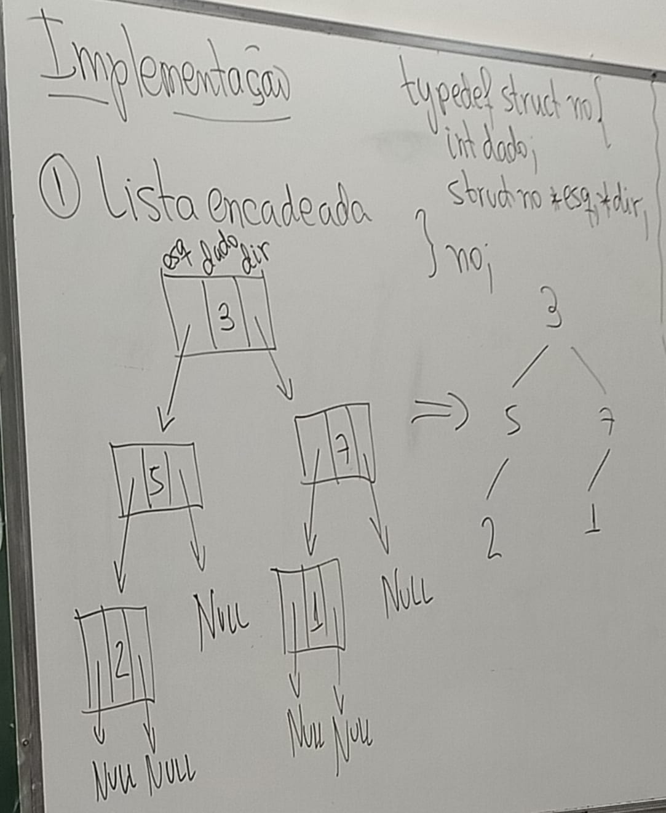

# Árvores

Uma árvore é um conjunto de elementos interligados entre s de tal forma que: um elemento é a raiz e os demais se dividem em n>= conjuntos distintos chamados subárvores.

	

# Conceitos

- Os elementos são chamados nós, e as linhas que os ligam, arestas.

- O nó que não possui nenhum "ascendente" é chamado raiz.

- O nó que não possui "descendente" é chamado folha.

- O grau de um nó é a quantidade de subárvores que se origina dele.

Se um árvore for tal que grau(x) <= 2, para qualquer x nó da árvore, então dizemos que essa é uma árvore binária.

# Árvore binária

	

Níveis são "gerações" da árvore.

- A altura de uma árvore é o seu maior nível.
- Um nível k pode ter, no máximo, 2ᵏ nós.
- Crescimento dos nós conforme aumenta-se o nível é exponencial.
- O máximo de nós numa árvore de altura h é:

2⁰+ 2¹ + 2² + ... + 2ʰ

        a1(qⁿ-1)         2⁰(2ʰ⁺¹-1)
       -----------  =  --------------  =  2ʰ⁺¹ -1
           q-1              2-1

Árvores são estruturas de dados não-lineares pois há vários formas distintas de se percorrer os elementos. As 3 formas padrões são:

- Pré-ordem (Raiz -> esquerda -> direita)
- Em ordem (Esquerda -> raiz -> direita)
- Pós ordem (Esquerda -> direita -> raiz)

## Pré-ordem

                     2
                   /   \
                  5     7
                 / \   / \
                3   8 1   6
                   /   \
                  4     9

### Saída:  2 5 3 8 4 7 1 9 6

## Em-ordem

                     2
                   /   \
                  5     7
                 / \   / \
                3   8 1   6
                   /   \
                  4     9

### Saída:  3 5 4 8 2 1 9 7 6

## Pós-ordem

                     2
                   /   \
                  5     7
                 / \   / \
                3   8 1   6
                   /   \
                  4     9

### Saída:  3 4 8 5 9 1 6 7 2

Em árvore vetor é mais facil de ordenar do que lista encadeada.

# Implementação

	

