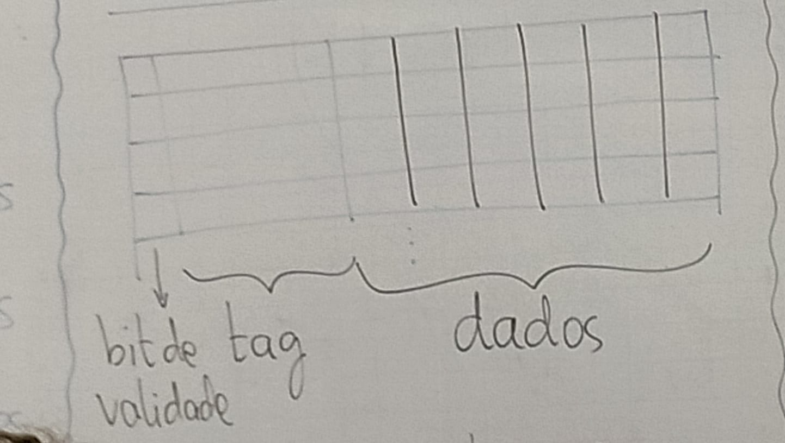

# Mapeamento direto

## Dados:

- Memória principal: 2^t bytes
- Memória cache: 2^n bytes
- Blocos: 2^b bytes

End. mem. principal

tag|linha cache|bloco
--- | --- | ---
t-n-b bits|n bits|b bits

t bits ^^^^^^

# Tamanho real da cache

	

Quando dizemos o tamanho de uma memória cache, nos referimos ao total de dados que ela pode armazenar.

Para calcular o tamanho real de uma cahce, é necessário incluir o bit de validade e a tag. Logo, Para determinar esse tamanho

1) Determinar o tamanho, em bytes, (i) da memória principal e (ii) de um bloco da cache. Por ultimo, determinar o tamanho o total de linhas da cache (Em outras palavras queremos determinar t, n e b).
2) Determinar o tamanho da tag = t - n - b
3) Tam. real da cache = n x (1 + tag + dados)

### Obs: São dados: o tamanho (dados) da cache, o tamanho de um bloco e o tamanho a memória principal.

# Lembrando que:

1 byte = 8 bits 
1 KiB = 2^10 bytes 
1 MiB = 2^10 KiB = 2^20 B 
1 GiB = 2^10 MiB = 2^20 KiB = 2^30 B 
1 TiB = 2^10 GiB = 2^20 MiB = 2^30 KiB = 2^30 KiB = 2^40 B 