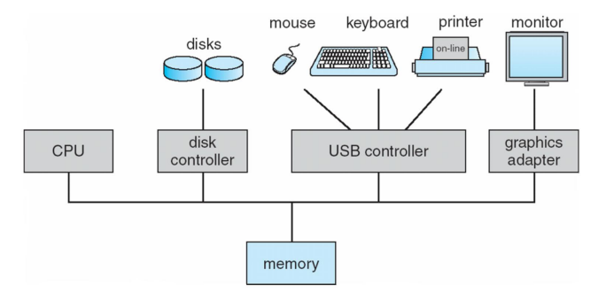
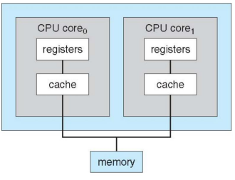

# Capítulo 01

## O que é um sistema operacional?

- Um sistema operacional é um software que controla os recursos de hardware e software de um computador e fornece serviços para aplicativos.
- Ele atua como uma interface entre os usuários e o hardware do computador, gerenciando a execução de programas e permitindo a comunicação entre os aplicativos e o hardware.

## Estrutura do Sistema de Computador

###  O sistema de computador pode ser dividido em quatro componentes:

- Hardware – fornece recursos básicos de computação
  - Partes físicas do computador ( CPU, memória, ... )
- Sistema operacional
  - Controla e coordena o uso de hardware entre vários aplicativos e usuários
- Programas aplicativos
  - Definem as maneiras pelas quais os recursos do sistema são usados para resolver os problemas de computação dos usuários
-  Usuários
   - Pessoas, máquinas, outros computadores
  
## O que os sistemas operacionais fazem?

- Um sistema operacional é um software que gerencia os recursos de hardware e software de um computador e fornece serviços para aplicativos.  
- Ele gerencia a memória, processos, arquivos e dispositivos de entrada e saída do computador, fornece uma interface de usuário, recursos de rede e segurança.  
- Em resumo, o sistema operacional é a base que permite que os usuários interajam com o computador e os aplicativos de maneira eficiente e eficaz.

## Inicialização do computador

Obs.: Bootstrap = carregador de inicialização
- O programa bootstrap é geralmente armazenado em um chip de memória não-volátil no computador, como a ROM (Read-Only Memory) ou a EEPROM (Electrically Erasable Programmable Read-Only Memory), e é executado automaticamente sempre que o computador é ligado ou reinicializado.
  -  Inicializa todos os aspectos do sistema
  -  Carrega o kernel do sistema operacional e inicia a execução 
  Obs.: Kernel é a parte central de um sistema operacional, que age como um intermediário entre o hardware e os programas em execução no computador. Ele é responsável por gerenciar recursos como memória, processadores, dispositivos de entrada e saída, entre outros, e garantir que cada programa tenha acesso aos recursos necessários de forma segura e eficiente.

## Organização do Sistema de Computador

-  Operação do sistema de computador
   -  Uma ou mais CPUs, controladores de dispositivos conectam-se por meio de um barramento comum, fornecendo acesso à memória compartilhada
   -  Execução simultânea de CPUs e dispositivos competindo por ciclos de memória

	

## Operação do Sistema de Computador

- Os dispositivos de I/O (Input/Output ou entrada e saída) e a CPU podem ser executados simultaneamente
- Cada controlador de dispositivo é responsável por um determinado tipo de dispositivo
- Cada controlador de dispositivo possui um buffer local  
Obs.:  Buffer é uma área temporária de armazenamento de dados em memória.
-  CPU move dados de/para a memória principal para/de buffers locais
-   O controlador do dispositivo informa à CPU que encerrou sua operação causando uma interrupção

## Funções Comuns de Interrupções

- A interrupção é um mecanismo que transfere o controle de execução de um programa para uma rotina de serviço de interrupção.
- Uma armadilha ou exceção é um tipo especial de interrupção que é gerada por software em resposta a um erro ou a uma solicitação do usuário.
-  Um sistema operacional é orientado a interrupções, o que significa que ele é construído em torno do conceito de interrupções e é capaz de lidar com várias interrupções simultaneamente. 
-  O sistema operacional tem rotinas de serviço de interrupção definidas que podem lidar com as interrupções geradas pelo hardware e pelo software.

## Tratamento de interrupção

-   Um sistema operacional geralmente preserva o estado da CPU armazenando registradores e o contador de programa em memória quando ocorre uma interrupção. 
-   Existem diferentes tipos de mecanismos de interrupção, como votação e sistema de interrupção vetorial.
-   Em um sistema de interrupção vetorial, cada tipo de interrupção tem um número associado a ele, que é usado para encontrar a rotina apropriada para lidar com a interrupção. 
-   Em um sistema de segmentos separados de código, cada tipo de interrupção é associado a uma rotina específica de código, que é executada quando a interrupção ocorre. Essas diferentes técnicas permitem que o sistema operacional responda efetivamente às interrupções, permitindo que as operações sejam retomadas após o término da interrupção.

## Estrutura de I/O

- Quando ocorre uma operação de entrada/saída (I/O), o controle retorna ao programa do usuário somente após a conclusão da operação.
- A instrução de espera deixa a CPU ociosa até a próxima interrupção, o que pode causar um loop de espera (contenção de acesso à memória).
- No máximo, uma requisição de I/O está pendente por vez, e não há processamento simultâneo de I/O.
- Após o início da operação de I/O, o controle retorna ao programa do usuário sem esperar pela conclusão da operação.
- É possível fazer uma chamada do sistema para solicitar ao sistema operacional que permita que o usuário aguarde a conclusão da operação de I/O.
- A tabela de status do dispositivo contém uma entrada para cada dispositivo de I/O, com informações como seu tipo, endereço e estado.
- O sistema operacional usa índices na tabela de dispositivos de I/O para determinar o status do dispositivo e modificar a entrada da tabela para incluir interrupção.

## Definições de armazenamento e revisão de notação

- Armazenamento refere-se à capacidade de um computador armazenar informações de forma temporária ou permanente.
- A memória principal do computador é usada para armazenar programas em execução e seus dados.
- A memória secundária, como discos rígidos e dispositivos de armazenamento em nuvem, é usada para armazenamento de longo prazo.
- A notação é uma forma de escrever informações em uma linguagem específica.
- Em programação, existem várias notações, incluindo a notação matemática, a notação de diagrama de fluxo e a notação de pseudocódigo.
- A notação matemática é usada para expressar equações e fórmulas matemáticas.
- A notação de diagrama de fluxo é usada para representar processos e fluxos de dados em um programa.
- A notação de pseudocódigo é uma forma de escrever um programa em linguagem natural, usando palavras-chave e estruturas de controle de fluxo.

## Estrutura de armazenamento

- Memória principal (RAM)
  -   Apenas mídia de armazenamento grande que a CPU pode acessar diretamente
      - Acesso aleatório
      - Tipicamente volátil (Por conta do acesso aleatório)
- Armazenamento secundário 
  - Extensão da memória principal que fornece grande capacidade de armazenamento não volátil
- Discos rígidos (HD)
  - Pratos rígidos de metal ou vidro cobertos com material de gravação magnética
    - A superfície do disco é logicamente dividida em trilhas, que são subdivididas em setores
    -   O controlador de disco determina a interação lógica entre o dispositivo e o computador
- Discos de estado sólido (SSD)
  - Mais rápidos que os discos rígidos, não voláteis
    - Várias tecnologias
    - Tornando-se mais popular
- Registradores 
  - Os registradores são dispositivos de armazenamento mais rápidos e de menor capacidade, localizados diretamente na CPU. 
  - Eles são usados para armazenar dados temporários que a CPU precisa acessar rapidamente.
- Memória cache
    - A memória cache é um tipo de memória RAM de alta velocidade, localizada próxima à CPU. 
    - É usada para armazenar dados que a CPU acessa com frequência, a fim de reduzir o tempo de acesso à memória principal.

## Hierarquia de armazenamento

Registradores > Memória cache > Memória pricipal > SSD > HD > Disco optico > Fita magnética

## Arquitetura do Sistema de Computador

- A maioria dos sistemas usa um único processador de propósito geral
  - A maioria dos sistemas também possui processadores para fins especiais
- Sistemas multiprocessadores crescendo em uso e importância
  -  Também conhecidos como sistemas paralelos, sistemas fortemente acoplados
  - As vantagens incluem:
    -  Maior produtividade
    -  Economia de escala
    -  Maior confiabilidade 
       -  Degradação normal ou tolerância a falhas
  - Dois tipos:
    - Multiprocessamento assimétrico 
      -  Cada processador recebe uma espécie de tarefa
    - Multiprocessamento simétrico 
      - Cada processador executa todas as tarefas

## Um design de núcleo duplo

-   Multichip e multicore
-   Sistemas contendo todos os chips
    -   Chassis contendo vários sistemas separados
  

	

## Sistemas agrupados

- Os sistemas de cluster são compostos por vários sistemas trabalhando juntos como se fossem um único sistema.
- Eles geralmente compartilham armazenamento através de uma rede de área de armazenamento (SAN).
- O objetivo é fornecer um serviço de alta disponibilidade que possa sobreviver a falhas.
- Existem dois tipos de clusters: assimétrico e simétrico.
- O clustering assimétrico tem uma máquina em modo de espera ativa, enquanto o simétrico tem vários nós executando aplicativos e monitorando uns aos outros.
- Alguns clusters são usados para computação de alto desempenho (HPC).
- Os aplicativos devem ser escritos para usar paralelização para que possam ser executados em vários nós do cluster simultaneamente.
- Alguns clusters usam gerenciadores de bloqueio distribuído (DLM) para evitar conflitos de operações.

## Estrutura do sistema operacional

- Multiprogramação é necessária para manter a CPU e os dispositivos de I/O ocupados.
- A multiprogramação organiza tarefas (código e dados) na memória.
- Um subconjunto do total de trabalhos no sistema é mantido na memória.
- Um trabalho é selecionado e executado via agendamento de trabalho.
- O compartilhamento de tempo (multitarefa) permite que a CPU troque tarefas com frequência, criando computação interativa.
- Cada usuário tem pelo menos um programa em execução na memória.
- Se várias tarefas estiverem prontas para serem executadas ao mesmo tempo, é feito o escalonamento da CPU.
- Se os processos não couberem na memória, a troca move-os para dentro e para fora da execução.
- A memória virtual permite a execução de processos que não estão completamente na memória física.

## Operações do sistema operacional

- Acionado por interrupção (hardware e software)
  -  Interrupção de hardware por um dos dispositivos 
  -   Interrupção de software (exceção ou trap):
      -   Erro de software (por exemplo, divisão por zero)
      -   Solicitação de serviço do sistema operacional 
      -   Outros problemas de processo incluem loop infinito, processos modificando uns aos outros ou o sistema operacional
- A operação em modo duplo permite que o sistema operacional proteja a si mesmo e a outros sistemas componentes
  -   Modo de usuário e modo de kernel
  - Bit de modo fornecido pelo hardware
    - Fornece capacidade de distinguir quando o sistema está sendo executado pelo usuário código ou código do kernel
    - Algumas instruções designadas como privilegiadas, somente executável no modo kernel
    - A chamada do sistema altera o modo para o kernel, o retorno da chamada é redefinido para o usuário

-    Cada vez mais as CPUs suportam operações multimodo
     -   ou seja, modo de gerenciador de máquina virtual (VMM) para VMs convidadas

## Gerenciamento de processos

-    Um processo é um programa em execução.
     -    O programa é uma entidade passiva, o processo é uma entidade ativa.
- O processo precisa de recursos para realizar sua tarefa
  - CPU, memória, I/O, arquivos
  -  Dados de inicialização

### O que é uma Thread?

- Uma thread é uma unidade básica de um processo, capaz de executar uma sequência de instruções de forma independente.
- Cada thread compartilha o mesmo espaço de endereço do processo e possui seu próprio conjunto de registradores e pilha de execução. 
- As threads podem ser executadas de forma simultânea em sistemas multiprocessados ou por meio de escalonamento em sistemas monoprocessados, permitindo a execução de tarefas concorrentes. 
- O uso de threads pode melhorar a eficiência e escalabilidade de um programa, permitindo que múltiplas tarefas sejam executadas ao mesmo tempo.

-    Processo de thread único tem um contador de programa especificando localização da próxima instrução a ser executada
     -   Processo executa instruções sequencialmente, uma de cada vez, até a 
conclusão
         -  Processo multi-thread tem um contador de programa por thread
         -  Tipicamente o sistema tem muitos processos, alguns usuários, outros sistema operacional rodando simultaneamente em uma ou mais CPUs
         - Simultaneidade pela multiplexação das CPUs entre os processos / tópicos

## Atividades de gerenciamento de processos

O sistema operacional é responsável pelas seguintes atividades 
relacionadas ao gerenciamento de processos:

- Criar e excluir processos do usuário e do sistema
-  Suspender e retomar processos  
-  Fornecer mecanismos para sincronização de processos  
-  Fornecer mecanismos para comunicação de processos  
-  Fornecer mecanismos para tratamento de deadlock 
  Obs.: Deadlock (ou impasse) é uma situação em que dois ou mais processos ficam bloqueados, aguardando um ao outro para liberar recursos que cada um deles precisa para continuar a execução. Isso resulta em uma paralisação mútua, em que nenhum processo pode progredir e a CPU fica ociosa. Para resolver um deadlock, é necessário interromper um ou mais processos envolvidos, liberando os recursos que estão segurando e permitindo que outros processos possam continuar.
  
